# [milestone-project](https://kearns55.github.io/milestone-project)

Developer: Rebekah Kearns ([kearns55](https://www.github.com/kearns55))

# Overview:
*I decided to make a portfolio website for my art as my first project because painting and coding are two of my biggest passions, also being able to showcase my coding skills alongside my paintings makes me very proud. I hope in the future I can make more creative based websites and more portfolios for other artists.This project has taken a lot of time and effort to produce and I hope you love it as much as I do!*

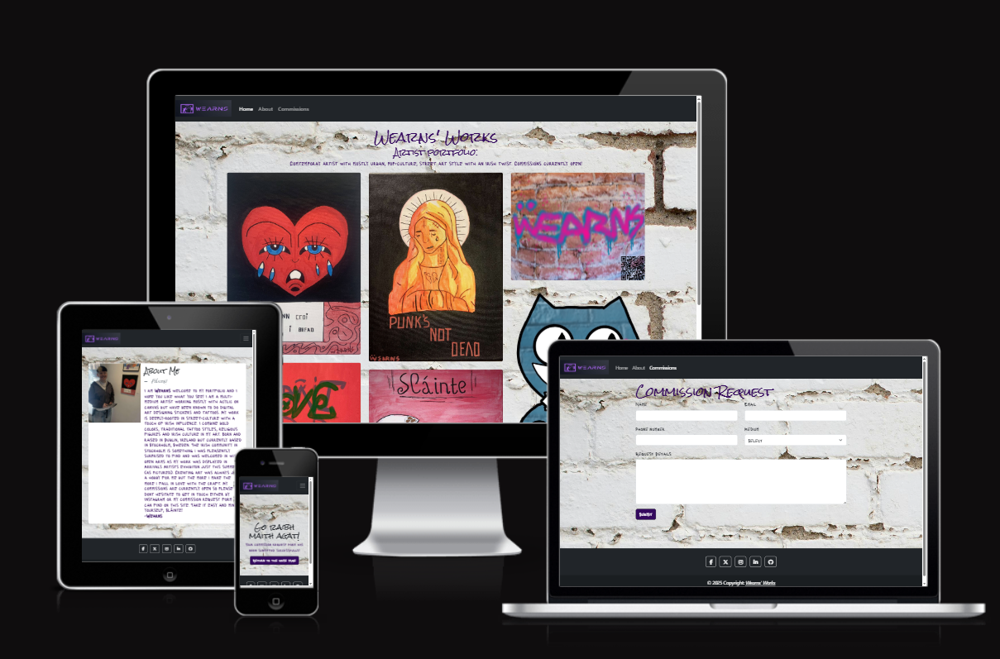

source: [milestone-project amiresponsive](https://ui.dev/amiresponsive?url=https://kearns55.github.io/milestone-project)

## UX

### The 5 Planes of UX

#### 1. Strategy

**Purpose**
- Showcase my art in a user friendly and understandable way.
- Engage and encourage future clients to purchase my art.

**Primary User Needs**
- Learn about my background and my art style.
- Showcase my art through a high-quality image gallery.
- Access responsive, user-friendly content.

**Business Goals**
- Recieve commissions from future clients.
- Boost social media presence and gain more exposure.
#### 2. Scope
**[Features](#features)** (see below)

**Content Requirements**
- Informative "about me" page to engage and interest visitors of the site.
- Photos showcasing my art.
- Commission form for users to fill out and rquest their very own piece.

#### 3. Structure

**Information Architecture**
- **Navigation Menu**:
  - Accessible links in the navbar.
  - Drop-down menu for navbar links on mobile devices.
- **Hierarchy**:
  - Prominent placement of social media links in the footer.

**User Flow**
1. User lands on the home page → engages user with bright, bold, eye-catching artwork.
2. Browses the gallery → inspired to find out more about the artist.
3. Navigates to about me page → sees picture of myself and about me written section to build familiarity between myself and visitors of the site.
4. Proceeds to commissions form → fills out form and is met with success page including return to home page button.

#### 4. Skeleton

**[Wireframes](#wireframes)** (see below)

#### 5. Surface

**Visual Design Elements**
- **[Colours](#colour-scheme)** (see below)
- **[Typography](#typography)** (see below)

### Colour Scheme

I used [coolors.co](https://coolors.co/34095e-212429-e4e3e0-94a6b9) to generate my color palette.

- `#34095E` primary text.
- `#212429` secondary text.
- `#e5e6e3` background colour.
- `#94a3b1` hightlight colour

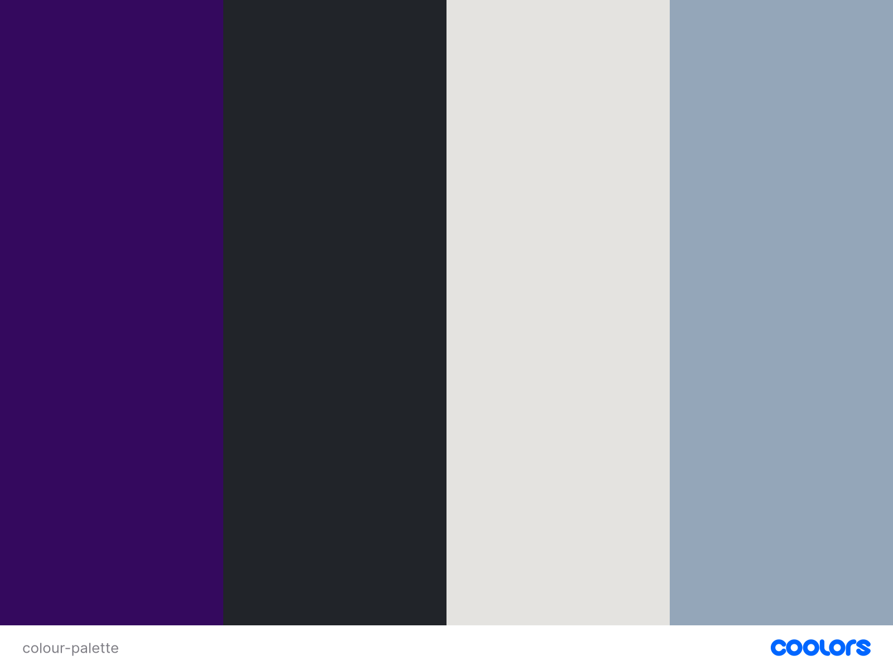

### Typography

- [Rock Salt](https://fonts.google.com/specimen/Rock+Salt) was used for the primary headers and titles.
- [Lacquer](https://fonts.google.com/specimen/Lacquer) was used for all other secondary text.
- [Font Awesome](https://fontawesome.com) icons were used throughout the site, such as the social media icons in the footer.

## Wireframes

To follow best practice, wireframes were developed for mobile and desktop sizes.
I've used Procreate (https://procreate.com) to design my site wireframes.

| Page | Mobile  | Desktop |
| --- | --- | --- |
| Home | 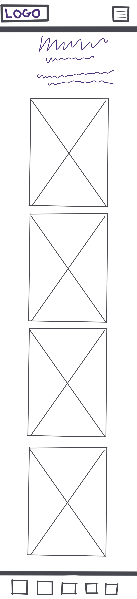 | 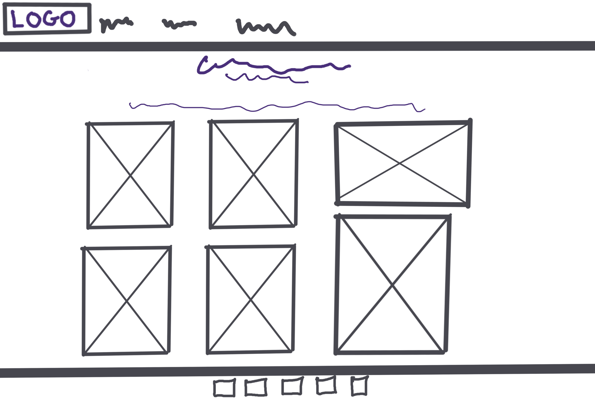 |
| About Me | 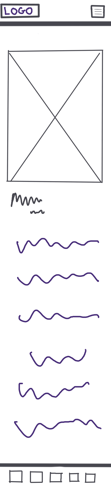 | 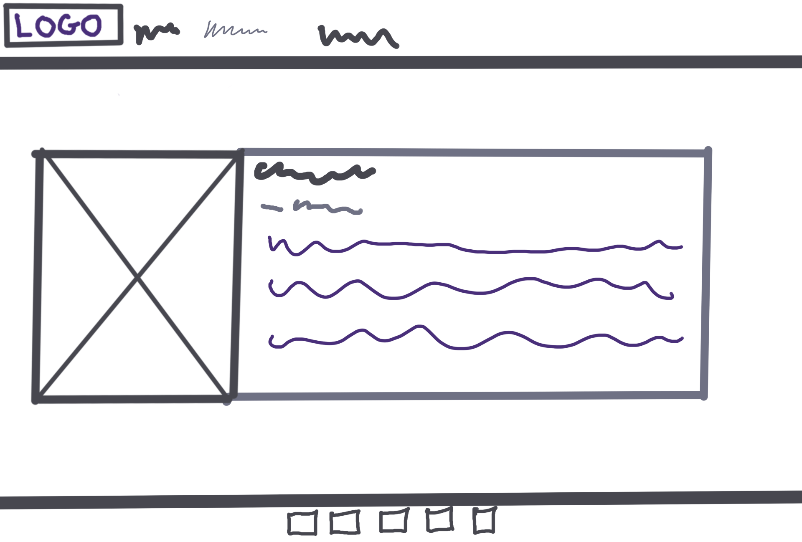 |
| Commission | 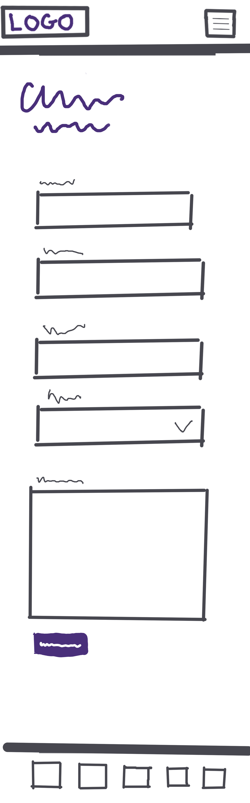 | 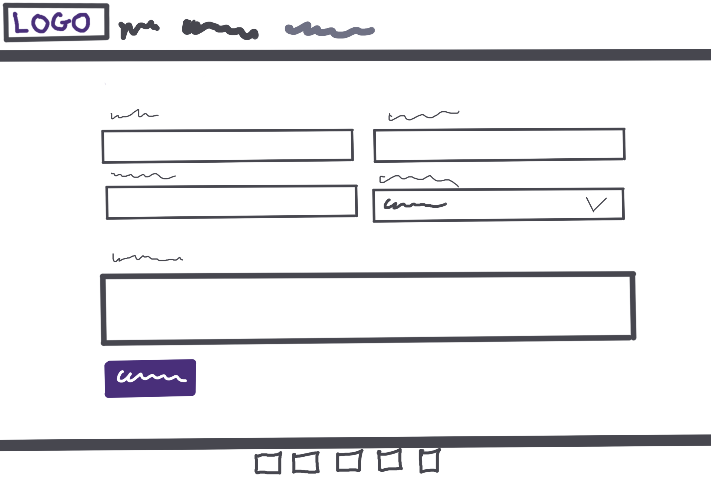 |
| Success | 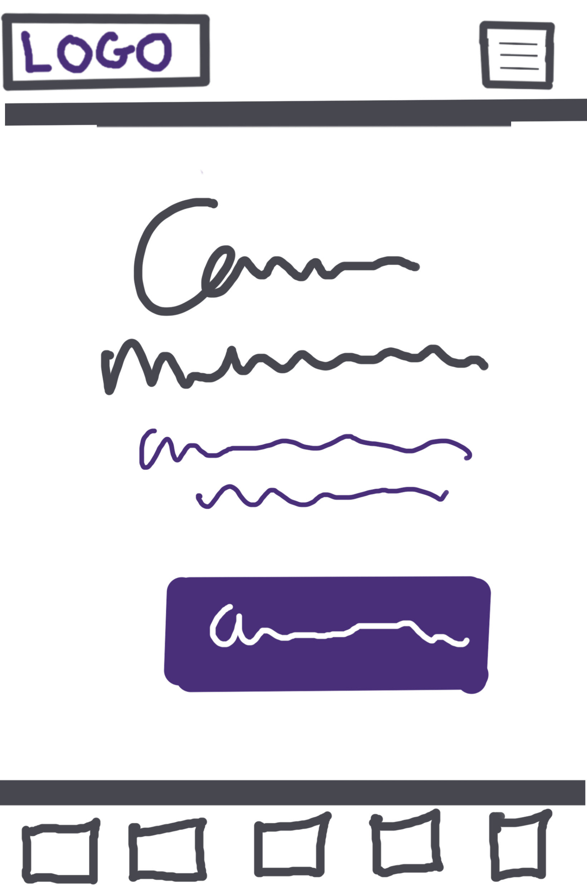 | 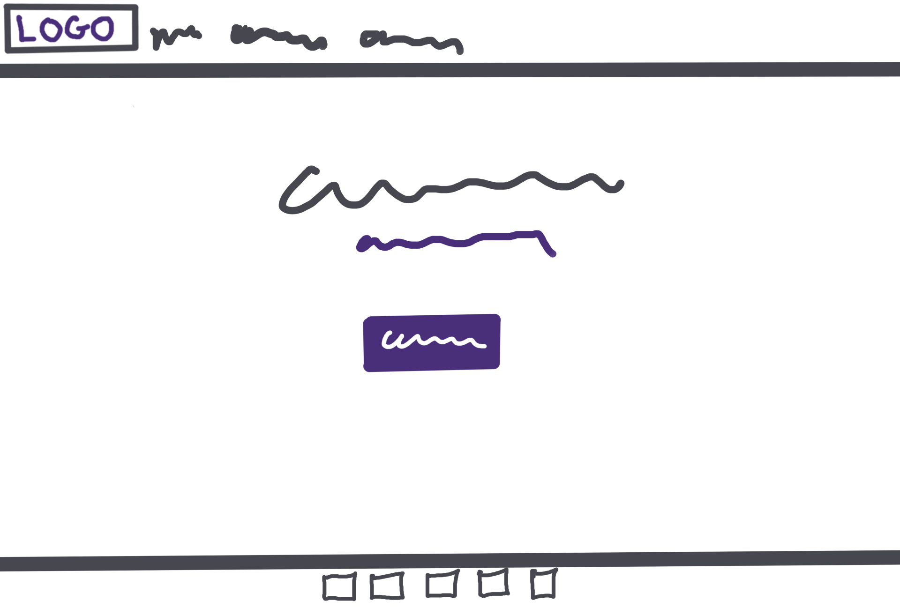 |
| 404 | 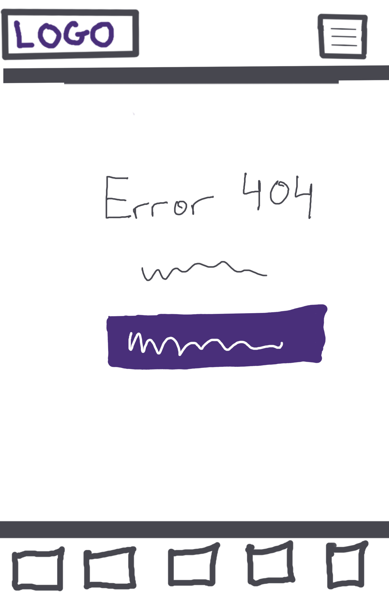 | 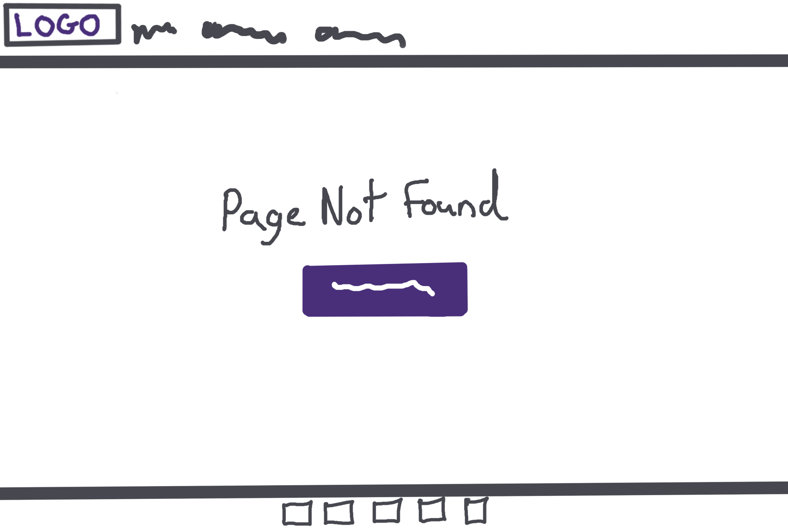 |

## User Stories

| Target | Expectation | Outcome |
| --- | --- | --- |
| As a user | I would like to see high quality images of the art. | so that I can descide if I want to commission my own piece. |
| As a user | I would like to learn more about the artist through an about me page | so that I can be more engaged. |
| As a collector | I would like to be able to request my own art work | so that I can support the artist. |
| As a user | I would like to be able to find the artist on soclai media easily | so that I can keep up with their art|
| As a user | I would like the website to be fully responsive | so that I can easily navigate and access information from my phone, tablet, or desktop. |
| As a user | I would like to see a 404 error page if I get lost | so that it's obvious that I've stumbled upon a page that doesn't exist. |

## Features

### Existing Features

| Feature | Notes | Screenshot |
| --- | --- | --- |
| Navbar | Featured on all three pages, the full responsive navigation bar includes links to the Logo, Home page, Gallery, and Commission form, and is identical in each page to allow for easy navigation. The navbar also includes a logo image that acts as a back to home screen button. On the smallest screens, a burger icon is used to toggle the navbar so it doesn't take up too much space. This section will allow the user to easily navigate from page to page across all devices without having to revert back to the previous page via the "back" button. The navbar is also `fixed`, so it stays in view even if the user has scrolled to the bottom of the page. | 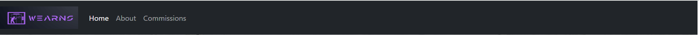 |
| Footer | The footer includes links to the relevant social media sites for my art. The links will open in a new tab to allow easy navigation for the user. The footer is valuable to the user, as it encourages them to keep connected via social media. | 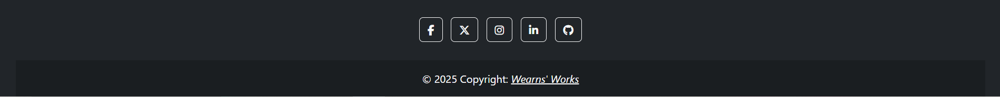 |
| Gallery | The gallery will provide the user with supporting images to display my art. This section is valuable to the user, as it is eye-catching and draws them in to explore more of the site. It's responsive so no images stretch or skew, showing images stacked by 1 on mobile and smaller screens and by 3 on desktop and larger screns. | 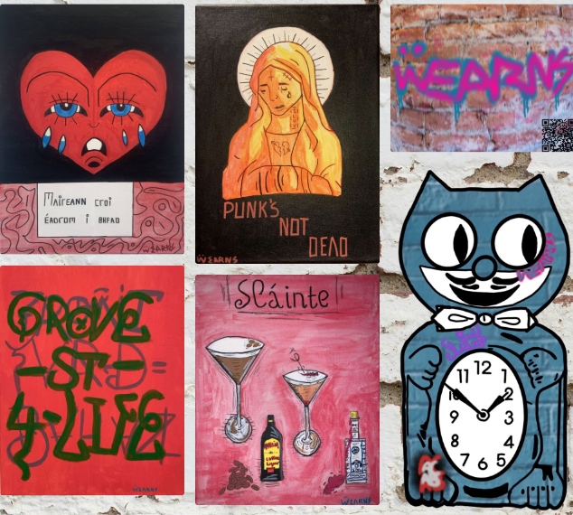 |
| Commission form | This page will allow the user to fill out a commission request form. The user can pick from 5 medium options for their art piece whether they want a painting on canvas or a digital drawing for example. The user will be asked to submit their full name and email address. | 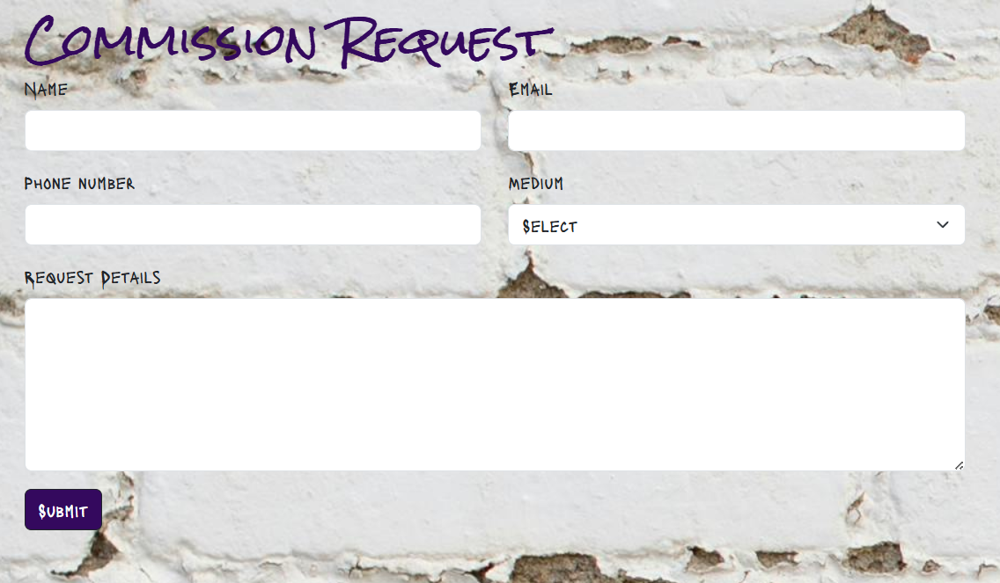 |
| Confirmation | The confirmation page will give the illusion that the signup form was submitted successfully. Due to the lack of a database or email system so far, this is a fake confirmation page and has a return to home page button. | 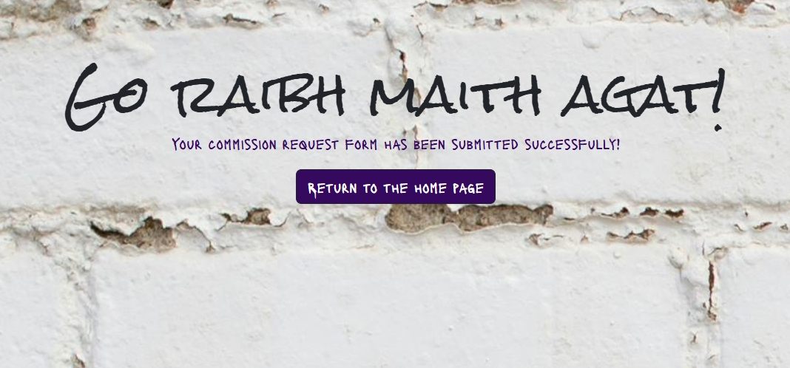 |
| 404 | The 404 error page will indicate when a user has somehow navigated to a page that doesn't exist. This replaces the default GitHub Pages 404 page, and ties-in with the look and feel of the Wearns works site by using the standard navbar and footer. | 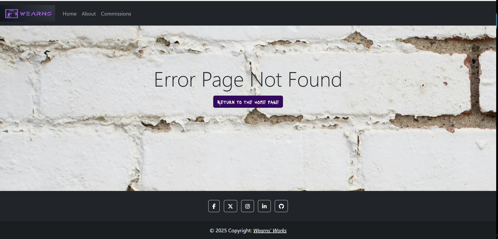 |

### Future Features

- **Newsletter Sign Up**: Allow users to sign up to a newsletter to inform them of future exhibitions that I would be apart of.
- **Merchandise Purchasing**: Make an e-commerce page on the site to sell merchandise with the Wearns Works logo or past art pieces as prints.

## Tools & Technologies

| Tool / Tech | Use |
| --- | --- |
|  | Generate README and TESTING templates. |
|  | Version control. (`git add`, `git commit`, `git push`) |
|  | Secure online code storage. |
|  | Local IDE for development. |
|  | Main site content and layout. |
|  | Design and layout. |
|  | Hosting the deployed front-end site. |
|  | Front-end CSS framework for modern responsiveness and pre-built components. |
|  | Icons. |
|  | Tutorials/Reference Guide |
|  | Troubleshooting and Debugging |

## Agile Development Process

### GitHub Projects

[GitHub Projects](https://www.github.com/kearns55/milestone-project/projects) served as an Agile tool for this project. Through it, EPICs, User Stories, issues/bugs, and Milestone tasks were planned, then subsequently tracked on a regular basis using the Kanban project board.

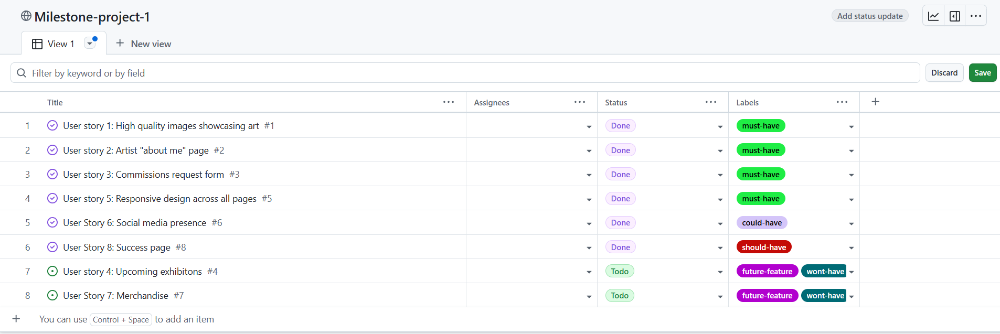

### GitHub Issues

[GitHub Issues](https://www.github.com/kearns55/milestone-project/issues) served as an another Agile tool. There, I managed my User Stories and Milestone tasks, and tracked any issues/bugs.

| Link | Screenshot |
| --- | --- |
|  | 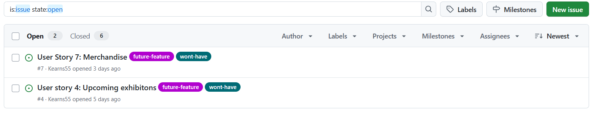 |
|  | 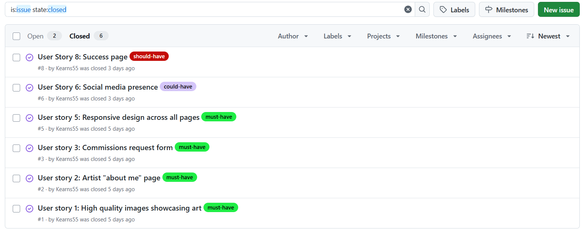 |

### MoSCoW Prioritization

I've decomposed my Epics into User Stories for prioritizing and implementing them. Using this approach, I was able to apply "MoSCoW" prioritization and labels to my User Stories within the Issues tab.

- **Must Have**: guaranteed to be delivered - required to Pass the project (*max ~60% of stories*)
- **Should Have**: adds significant value, but not vital (*~20% of stories*)
- **Could Have**: has small impact if left out (*the rest ~20% of stories*)
- **Won't Have**: not a priority for this iteration - future features

## Testing

> [!NOTE]
> For all testing, please refer to the [TESTING.md](TESTING.md) file.

## Deployment

### GitHub Pages

The site was deployed to GitHub Pages. The steps to deploy are as follows:

- In the [GitHub repository](https://www.github.com/kearns55/milestone-project), navigate to the "Settings" tab.
- In Settings, click on the "Pages" link from the menu on the left.
- From the "Build and deployment" section, click the drop-down called "Branch", and select the **main** branch, then click "Save".
- The page will be automatically refreshed with a detailed message display to indicate the successful deployment.
- Allow up to 5 minutes for the site to fully deploy.

The live link can be found on [GitHub Pages](https://kearns55.github.io/milestone-project).

### Local Development

This project can be cloned or forked in order to make a local copy on your own system.

#### Cloning

You can clone the repository by following these steps:

1. Go to the [GitHub repository](https://www.github.com/kearns55/milestone-project).
2. Locate and click on the green "Code" button at the very top, above the commits and files.
3. Select whether you prefer to clone using "HTTPS", "SSH", or "GitHub CLI", and click the "copy" button to copy the URL to your clipboard.
4. Open "Git Bash" or "Terminal".
5. Change the current working directory to the location where you want the cloned directory.
6. In your IDE Terminal, type the following command to clone the repository:
	- `git clone https://www.github.com/kearns55/milestone-project.git`
7. Press "Enter" to create your local clone.

Alternatively, if using Gitpod, you can click below to create your own workspace using this repository.

**Please Note**: in order to directly open the project in Gitpod, you should have the browser extension installed. A tutorial on how to do that can be found [here](https://www.gitpod.io/docs/configure/user-settings/browser-extension).

#### Forking

By forking the GitHub Repository, you make a copy of the original repository on our GitHub account to view and/or make changes without affecting the original owner's repository. You can fork this repository by using the following steps:

1. Log in to GitHub and locate the [GitHub Repository](https://www.github.com/kearns55/milestone-project).
2. At the top of the Repository, just below the "Settings" button on the menu, locate and click the "Fork" Button.
3. Once clicked, you should now have a copy of the original repository in your own GitHub account!

### Local VS Deployment

There are no remaining major differences between the local version when compared to the deployed version online.

## Credits

### Content

| Source | Notes |
| --- | --- |
| [Markdown Builder](https://markdown.2bn.dev) | Help generating Markdown files |
| [Bootstrap](https://getbootstrap.com) | Various components / responsive front-end framework |
| [MDBootstrap](https://mdbootstrap.com/docs/standard/navigation/footer/examples-and-customization/) | Custom Bootstrap Footer |
| [Jo Heyndels](https://codeinstitute.net) | Boardwalk Games code along project inspiration |

### Media

- Images
    - All images of artwork are my own.
- Image Compression
    - [TinyPNG](https://tinyPNG.com) (for images <5MB)
    - [CompressPNG](https://compressPNG.com) (for images >5MB)

| Source | Notes |
| --- | --- |
| [favicon.io](https://favicon.io) | Generating the favicon |
| [Font Awesome](https://fontawesome.com) | Icons used throughout the site |
| [Pexels](https://www.pexels.com/photo/white-brick-wall-1708852/) | Background Image
| [TinyPNG](https://tinyPNG.com) | Compressing images < 5MB |
| [CompressPNG](https://compressPNG.com) | Compressing images > 5MB |
| [Looka](https://looka.com/editor/222104985) | Logo Generator

### Acknowledgements

- I would like to thank my Code Institute mentor, [Tim Nelson](https://www.github.com/TravelTimN) for the support throughout the development of this project.
- I would like to thank the [Code Institute Slack community](https://code-institute-room.slack.com) for the moral support; it kept me going during periods of self doubt and impostor syndrome.
- I would like to thank my partner, for believing in me, and allowing me to make this transition into software development.
- I would like to thank my employer, for supporting me in my career development change towards becoming a software developer.

