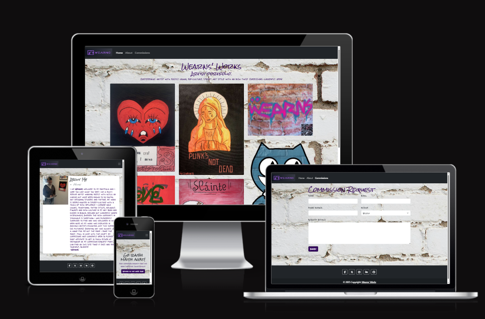
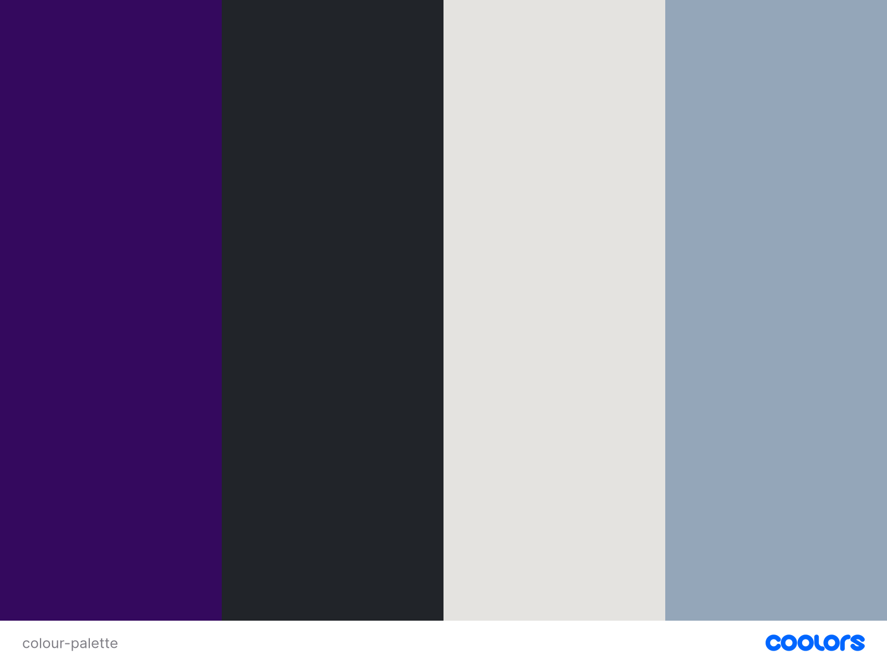
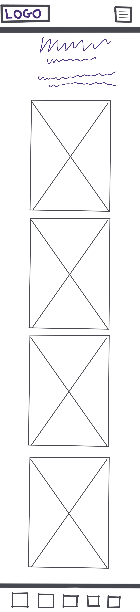
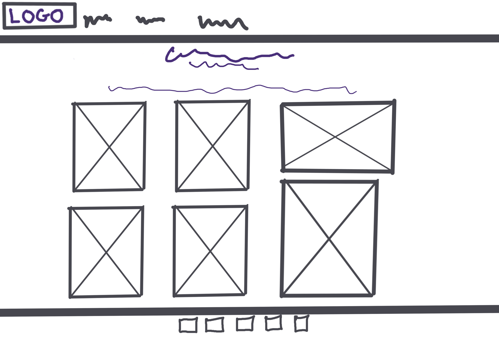
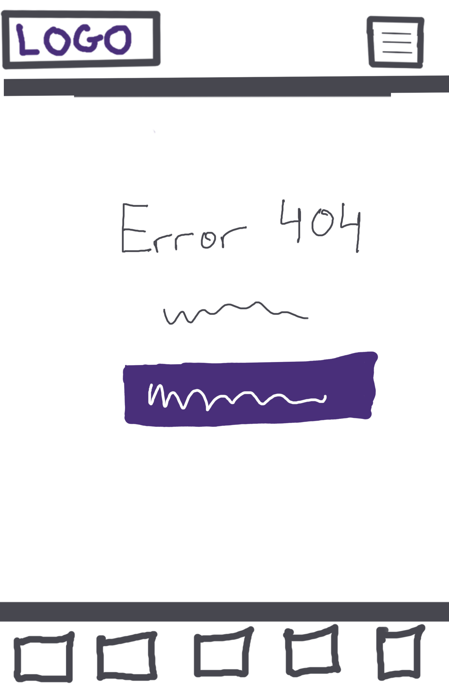
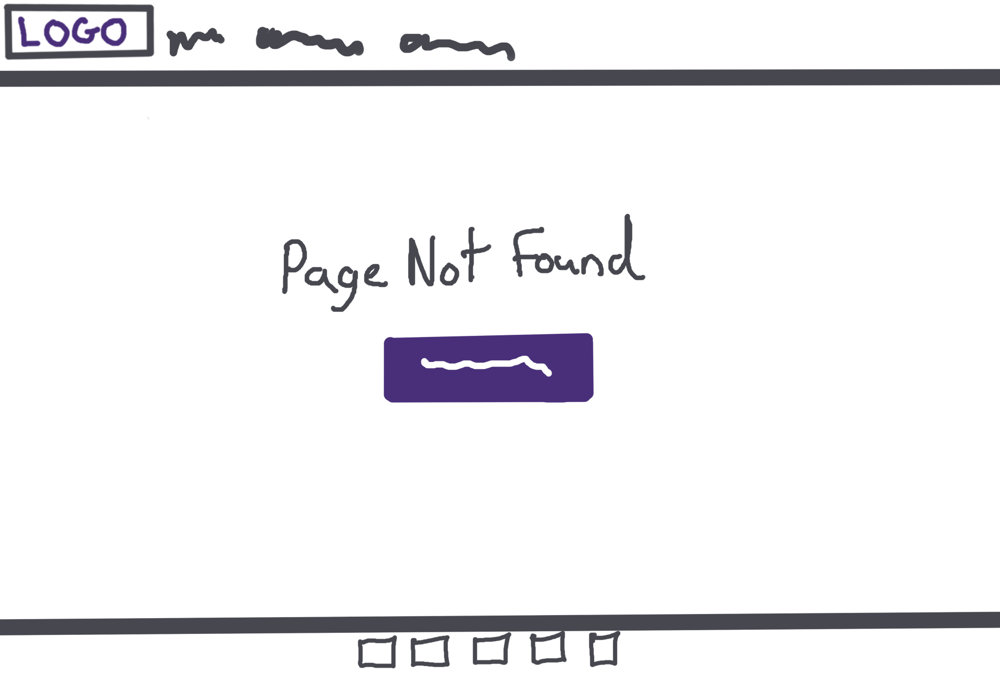

# [milestone-project](https://kearns55.github.io/milestone-project)

Developer: Rebekah Kearns ([kearns55](https://www.github.com/kearns55))

<<<<<<< HEAD

# Overview:
*I decided to make a portfolio website for my art as my first project because painting and coding are two of my biggest passions, also being able to showcase my coding skills alongside my paintings makes me very proud. I hope in the future I can make more creative based websites and more portfolios for other artists.This project has taken a lot of time and effort to produce and I hope you ove it as much as I do!*

source: [milestone-project amiresponsive](https://ui.dev/amiresponsive?url=https://kearns55.github.io/milestone-project)

=======
⚠️ INSTRUCTIONS ⚠️

In this section, include a few paragraphs providing an overview of your project. Essentially, this part is your "sales pitch". Describe what the project hopes to accomplish, who it is intended to target, and how it will be useful to the target audience.

⚠️ --- END --- ⚠️

🛑 NOTES 🛑

Do not add a **Table of Contents** to your Markdown files. GitHub has these built-in automatically using the headers/hashtags.

Don't add screenshots for the README/TESTING into your `assets` or `static` folders. Create a new folder at the root-level called `documentation`. Consider creating sub-directories within `documentation` to handle things like `wireframes`, `features`, `validation`, `responsiveness`, etc.

**Site Mockups**
*([amiresponsive](https://ui.dev/amiresponsive?url=https://kearns55.github.io/milestone-project), [techsini](https://techsini.com/multi-mockup), etc.)*
Having issues generating site mockups? This is likely due to security policies with your deployed site.
If you open up your DevTools, there may be an error referencing `X-Frame-Options`.

For Chrome users, head over to http://bit.ly/3iRPn4u and install the extension within your browser. Once installed, navigate back to the mockup site of your choice. You should find your site rendering in the various devices now.

Alternatively, open your project in Gitpod and run the server. Once the site is running, click the `Ports` tab from your Gitpod Terminal. Click the padlock on the appropriate port for your project (`Flask: 5000`, `Django: 8000`). This will make your local page public temporarily. Now, copy the URL of your live-preview page into the responsive tool above. You should find your site rendering in the various devices.

🛑 --- END ---- 🛑

source: [milestone-project amiresponsive](https://ui.dev/amiresponsive?url=https://kearns55.github.io/milestone-project)

> [!IMPORTANT]
> The examples in these templates are strongly influenced by the Code Institute walkthrough project called "Love Running".
>>>>>>> 4e1188b1167be56bd5d842798f88e11ea3683a99

## UX

### The 5 Planes of UX

⚠️ NOTE: make sure to update the text below to match your own project! ⚠️

#### 1. Strategy

**Purpose**
- Showcase my art in a user friendly and understandable way.
- Engage and encourage future clients to purchase my art.

**Primary User Needs**
- Learn about my background and my art style.
- Showcase my art through a high-quality image gallery.
- Access responsive, user-friendly content.

**Business Goals**
- Recieve commissions from future clients.
- Boost social media presence and gain more exposure.

#### 2. Scope
**[Features](#features)** (see below)

**Content Requirements**
- Informative "about me" page to engage and interest visitors of the site.
- Photos showcasing my art.
- Commission form for users to fill out and rquest their very own piece.

#### 3. Structure

**Information Architecture**
- **Navigation Menu**:
  - Accessible links in the navbar.
  - Drop-down menu for navbar links on mobile devices.
- **Hierarchy**:
  - Prominent placement of social media links in the footer.

**User Flow**
1. User lands on the home page → engages user with bright, bold, eye-catching artwork.
2. Browses the gallery → inspired to find out more about the artist.
3. Navigates to about me page → sees picture of myself and about me written section to build familiarity between myself anf visitors of the site.
4. Proceeds to commissions form → fills out form and is met with success page including return to home page button.

#### 4. Skeleton

**[Wireframes](#wireframes)** (see below)

#### 5. Surface

**Visual Design Elements**
- **[Colours](#colour-scheme)** (see below)
- **[Typography](#typography)** (see below)

### Colour Scheme

I used [coolors.co](https://coolors.co/34095e-212429-e4e3e0-94a6b9) to generate my color palette.

- `#34095E` primary text.
- `#212429` secondary text.
- `#e5e6e3` background colour.
- `#94a3b1` hightlight colour

### Typography

- [Rock Salt](https://fonts.google.com/specimen/Rock+Salt) was used for the primary headers and titles.
- [Lacquer](https://fonts.google.com/specimen/Lacquer) was used for all other secondary text.
- [Font Awesome](https://fontawesome.com) icons were used throughout the site, such as the social media icons in the footer.

## Wireframes

⚠️ INSTRUCTIONS ⚠️

If you've created wireframes or mock-ups, use this section to display screenshots of your wireframes. The example table below uses sample pages from the walkthrough project to give you some inspiration for your own project, so please adjust accordingly.

⚠️ --- END --- ⚠️

To follow best practice, wireframes were developed for mobile, tablet, and desktop sizes.
I've used [Balsamiq](https://balsamiq.com/wireframes) to design my site wireframes.

| Page | Mobile | Tablet | Desktop |
| --- | --- | --- | --- |
| Home |  |  |  |
| Gallery |  |  |  |
| Signup |  |  |  |
| Confirmation |  |  |  |
| 404 |  |  |  |

## User Stories

| Target | Expectation | Outcome |
| --- | --- | --- |
| As a user | I would like to see high quality images of the art. | so that I can descide if I want to commission my own piece. |
| As a user | I would like to learn more about the artist through an about me page | so that I can be more engaged. |
| As a collector | I would like to be able to request my own art work | so that I can support the artist. |
| As a user | I would like to be able to find the artist on soclai media easily | so that I can keep up with their art|
| As a user | I would like the website to be fully responsive | so that I can easily navigate and access information from my phone, tablet, or desktop. |
| As a user | I would like to see a 404 error page if I get lost | so that it's obvious that I've stumbled upon a page that doesn't exist. |

## Features

⚠️ INSTRUCTIONS ⚠️

In this section, you should go over the different parts of your project, and describe each feature. You should explain what value each of the features provides for the user, focusing on your target audience, what they want to achieve, and how your project can help them achieve these things.

**IMPORTANT**: Remember to always include a screenshot of each individual feature!

⚠️ --- END --- ⚠️

### Existing Features

| Feature | Notes | Screenshot |
| --- | --- | --- |
| Navbar | Featured on all three pages, the full responsive navigation bar includes links to the Logo, Home page, Gallery, and Signup page, and is identical in each page to allow for easy navigation. On the smallest screens, a burger icon is used to toggle the navbar so it doesn't take up too much space. This section will allow the user to easily navigate from page to page across all devices without having to revert back to the previous page via the "back" button. The navbar is also `fixed`, so it stays in view even if the user has scrolled to the bottom of the page. |  |
| Hero Image | The landing includes a photo with text-overlay to allow the user to see exactly which location this site would be applicable to. This section introduces the user to *Love Running* with an eye-catching animation to grab their attention. |  |
| Club Ethos | The club ethos section will allow the user to see the benefits of joining the *Love Running* meetups, as well as the benefits of running overall. The user will see the value of signing up for the *Love Running* meetups. This should encourage the user to consider running as their form of exercise. |  |
| Schedule | This section will allow the user to see exactly when the meetups will happen, where they will be located, and how long the run will be (in kilometers). The type of run (trail or road) is also shown, to help runners choose the meetups that best match their preference. This section will be updated as these times change to keep the user up to date. |  |
| Footer | The footer includes links to the relevant social media sites for *Love Running*. The links will open in a new tab to allow easy navigation for the user. The footer is valuable to the user, as it encourages them to keep connected via social media. |  |
| Gallery | The gallery will provide the user with supporting images to see what the meet-ups look like. This section is valuable to the user, as they will be able to easily identify the types of events that the organization puts together. It's responsive so no images stretch or skew, showing images stacked by 1 on mobile, by 2 on smaller tablets, by 3 on desktop, and by 4 on larger screens. |  |
| Signup | This page will allow the user to sign up to *Love Running* and start their running journey with the community. The user will be able specify if they would like to take part in road, trail, or both types of running. The user will be asked to submit their full name and email address. |  |
| Confirmation | The confirmation page will give the illusion that the signup form was submitted successfully to the *Love Running* club. Due to the lack of a database or email system so far, this is a fake confirmation page, and will automatically redirect the user back to the home page after 10 seconds. |  |
| 404 | The 404 error page will indicate when a user has somehow navigated to a page that doesn't exist. This replaces the default GitHub Pages 404 page, and ties-in with the look and feel of the *Love Running* site by using the standard navbar and footer. |  |

### Future Features

⚠️ INSTRUCTIONS ⚠️

Do you have additional ideas that you'd like to include on your project in the future? Fantastic, list them here! It's always great to have plans for future improvements. Consider adding any helpful links or notes to help remind you in the future, if you revisit the project in a couple years.

A few examples are listed below to align with possible ways to improve on the sample walkthrough project, to give you some inspiration.

⚠️ --- END ---⚠️

- **Personalized User Profiles**: Allow users to create accounts where they can track their running progress, view personal stats, and share their achievements.
- **Training Plans**: Offer customizable training plans for runners of all levels (beginner, intermediate, advanced) with notifications and reminders.
- **Event Registration & Payment**: Integrate an option for runners to register and pay for upcoming events or races directly through the site.
- **Achievements & Badges**: Introduce a gamification system where users earn badges or achievements for reaching milestones (e.g., number of runs, personal bests, attending events).
- **Interactive Maps**: Display interactive running route maps, complete with distance markers, elevation data, and difficulty ratings.
- **Live Event Tracking**: Provide real-time tracking for major club events so users can follow along or support friends running in real-time.
- **Runner's Blog**: Include a blog section for members to share their running experiences, tips, and stories, fostering community engagement.
- **Leaderboards**: Add a feature where users can compare their running stats with others in the club via leaderboards (e.g., most kilometers run, fastest times).
- **Weekly Challenges**: Implement weekly running challenges or group challenges to keep users motivated and engaged.
- **Weather Integration**: Show local weather conditions for Dublin and suggest the best times for a run, based on user preferences.
- **Social Sharing**: Enable users to share their runs, achievements, or event participation directly on social media from the site.
- **Club Merchandise Store**: Introduce an online store where users can purchase branded running gear like shirts, jackets, or water bottles.
- **Push Notifications**: Allow users to opt-in for mobile push notifications for schedule updates, new events, or motivational reminders.
- **Virtual Runs**: Create a platform for virtual runs where members can participate remotely and still receive medals or rewards.
- **Member Forums or Groups**: Introduce discussion boards or group chats for runners to connect, discuss upcoming events, or share training tips.
- **Charity Partnerships**: Offer integration with local charities where club members can run to raise money or awareness for specific causes.

## Tools & Technologies

| Tool / Tech | Use |
| --- | --- |
|  | Generate README and TESTING templates. |
|  | Version control. (`git add`, `git commit`, `git push`) |
|  | Secure online code storage. |
|  | Local IDE for development. |
|  | Main site content and layout. |
|  | Design and layout. |
|  | Hosting the deployed front-end site. |
|  | Front-end CSS framework for modern responsiveness and pre-built components. |
|  | Icons. |
|  | Tutorials/Reference Guide |
|  | Troubleshooting and Debugging |

⚠️ NOTE ⚠️

Want to add more?

- Tutorial: https://shields.io/badges/static-badge
- Icons/Logos: https://simpleicons.org
  - FYI: not all logos are available to use

🛑 --- END --- 🛑

## Agile Development Process

### GitHub Projects

⚠️ TIP ⚠️

Consider adding screenshots of your Projects Board(s), Issues (open and closed), and Milestone tasks.

⚠️ --- END ---⚠️

[GitHub Projects](https://www.github.com/kearns55/milestone-project/projects) served as an Agile tool for this project. Through it, EPICs, User Stories, issues/bugs, and Milestone tasks were planned, then subsequently tracked on a regular basis using the Kanban project board.

### GitHub Issues

[GitHub Issues](https://www.github.com/kearns55/milestone-project/issues) served as an another Agile tool. There, I managed my User Stories and Milestone tasks, and tracked any issues/bugs.

| Link | Screenshot |
| --- | --- |
|  |  |
|  |  |

### MoSCoW Prioritization

I've decomposed my Epics into User Stories for prioritizing and implementing them. Using this approach, I was able to apply "MoSCoW" prioritization and labels to my User Stories within the Issues tab.

- **Must Have**: guaranteed to be delivered - required to Pass the project (*max ~60% of stories*)
- **Should Have**: adds significant value, but not vital (*~20% of stories*)
- **Could Have**: has small impact if left out (*the rest ~20% of stories*)
- **Won't Have**: not a priority for this iteration - future features

## Testing

> [!NOTE]
> For all testing, please refer to the [TESTING.md](TESTING.md) file.

## Deployment

### GitHub Pages

The site was deployed to GitHub Pages. The steps to deploy are as follows:

- In the [GitHub repository](https://www.github.com/kearns55/milestone-project), navigate to the "Settings" tab.
- In Settings, click on the "Pages" link from the menu on the left.
- From the "Build and deployment" section, click the drop-down called "Branch", and select the **main** branch, then click "Save".
- The page will be automatically refreshed with a detailed message display to indicate the successful deployment.
- Allow up to 5 minutes for the site to fully deploy.

The live link can be found on [GitHub Pages](https://kearns55.github.io/milestone-project).

### Local Development

This project can be cloned or forked in order to make a local copy on your own system.

#### Cloning

You can clone the repository by following these steps:

1. Go to the [GitHub repository](https://www.github.com/kearns55/milestone-project).
2. Locate and click on the green "Code" button at the very top, above the commits and files.
3. Select whether you prefer to clone using "HTTPS", "SSH", or "GitHub CLI", and click the "copy" button to copy the URL to your clipboard.
4. Open "Git Bash" or "Terminal".
5. Change the current working directory to the location where you want the cloned directory.
6. In your IDE Terminal, type the following command to clone the repository:
	- `git clone https://www.github.com/kearns55/milestone-project.git`
7. Press "Enter" to create your local clone.

Alternatively, if using Gitpod, you can click below to create your own workspace using this repository.

**Please Note**: in order to directly open the project in Gitpod, you should have the browser extension installed. A tutorial on how to do that can be found [here](https://www.gitpod.io/docs/configure/user-settings/browser-extension).

#### Forking

By forking the GitHub Repository, you make a copy of the original repository on our GitHub account to view and/or make changes without affecting the original owner's repository. You can fork this repository by using the following steps:

1. Log in to GitHub and locate the [GitHub Repository](https://www.github.com/kearns55/milestone-project).
2. At the top of the Repository, just below the "Settings" button on the menu, locate and click the "Fork" Button.
3. Once clicked, you should now have a copy of the original repository in your own GitHub account!

### Local VS Deployment

⚠️ INSTRUCTIONS ⚠️

Use this space to discuss any differences between the local version you've developed, and the live deployment site. Generally, there shouldn't be [m]any major differences, so if you honestly cannot find any differences, feel free to use the following example:

⚠️ --- END --- ⚠️

There are no remaining major differences between the local version when compared to the deployed version online.

## Credits

⚠️ INSTRUCTIONS ⚠️

In the following sections, you need to reference where you got your content, media, and any extra help. It is common practice to use code from other repositories and tutorials (which is totally acceptable), however, it is important to be very specific about these sources to avoid potential plagiarism.

⚠️ --- END ---⚠️

### Content

⚠️ INSTRUCTIONS ⚠️

Use this space to provide attribution links for any borrowed code snippets, elements, and resources. Ideally, you should provide an actual link to every resource used, not just a generic link to the main site. If you've used multiple components from the same source (such as Bootstrap), then you only need to list it once, but if it's multiple Codepen samples, then you should list each example individually. If you've used AI for some assistance (such as ChatGPT or Perplexity), be sure to mention that as well. A few examples have been provided below to give you some ideas.

⚠️ --- END ---⚠️

| Source | Notes |
| --- | --- |
| [Markdown Builder](https://markdown.2bn.dev) | Help generating Markdown files |
| [Chris Beams](https://chris.beams.io/posts/git-commit) | "How to Write a Git Commit Message" |
| [Rosie Resumé](https://codeinstitute.net) | Code Institute walkthrough project inspiration |
| [Bootstrap](https://getbootstrap.com) | Various components / responsive front-end framework |
| [ChatGPT](https://chatgpt.com) | Help with code logic and explanations |

### Media

⚠️ INSTRUCTIONS ⚠️

Use this space to provide attribution links to any media files borrowed from elsewhere (images, videos, audio, etc.). If you're the owner (or a close acquaintance) of some/all media files, then make sure to specify this information. Let the assessors know that you have explicit rights to use the media files within your project. Ideally, you should provide an actual link to every media file used, not just a generic link to the main site, unless it's AI-generated artwork.

Looking for some media files? Here are some popular sites to use. The list of examples below is by no means exhaustive. Within the Code Institute Slack community, you can find more "free media" links by sending yourself (or Slackbot) the following command: `!freemedia`.

- Images
    - [Pexels](https://www.pexels.com)
    - [Unsplash](https://unsplash.com)
    - [Pixabay](https://pixabay.com)
    - [Lorem Picsum](https://picsum.photos) (placeholder images)
    - [Wallhere](https://wallhere.com) (wallpaper / backgrounds)
    - [This Person Does Not Exist](https://thispersondoesnotexist.com) (reload to get a new person)
- Audio
    - [Audio Micro](https://www.audiomicro.com/free-sound-effects)
- Video
    - [Videvo](https://www.videvo.net)
- Image Compression
    - [TinyPNG](https://tinypng.com) (for images <5MB)
    - [CompressPNG](https://compresspng.com) (for images >5MB)

A few examples have been provided below to give you some ideas on how to do your own Media credits.

⚠️ --- END ---⚠️

| Source | Notes |
| --- | --- |
| [favicon.io](https://favicon.io) | Generating the favicon |
| [Rosie CV](https://codeinstitute.net) | Sample images provided from the walkthrough projects |
| [Font Awesome](https://fontawesome.com) | Icons used throughout the site |
| [Pexels](https://images.pexels.com/photos/416160/pexels-photo-416160.jpeg) | Hero image |
| [Wallhere](https://c.wallhere.com/images/9c/c8/da4b4009f070c8e1dfee43d25f99-2318808.jpg!d) | Background wallpaper |
| [Pixabay](https://cdn.pixabay.com/photo/2017/09/04/16/58/passport-2714675_1280.jpg) | Background wallpaper |
| [DALL-E 3](https://openai.com/index/dall-e-3) | AI generated artwork |
| [TinyPNG](https://tinypng.com) | Compressing images < 5MB |
| [CompressPNG](https://compresspng.com) | Compressing images > 5MB |
| [CloudConvert](https://cloudconvert.com/webp-converter) | Converting images to `.webp` |

### Acknowledgements

⚠️ INSTRUCTIONS ⚠️

Use this space to provide attribution and acknowledgement to any supports that helped, encouraged, or supported you throughout the development stages of this project. It's always lovely to appreciate those that help us grow and improve our developer skills. A few examples have been provided below to give you some ideas.

⚠️ --- END ---⚠️

- I would like to thank my Code Institute mentor, [Tim Nelson](https://www.github.com/TravelTimN) for the support throughout the development of this project.
- I would like to thank the [Code Institute](https://codeinstitute.net) Tutor Team for their assistance with troubleshooting and debugging some project issues.
- I would like to thank the [Code Institute Slack community](https://code-institute-room.slack.com) for the moral support; it kept me going during periods of self doubt and impostor syndrome.
- I would like to thank my partner, for believing in me, and allowing me to make this transition into software development.
- I would like to thank my employer, for supporting me in my career development change towards becoming a software developer.

